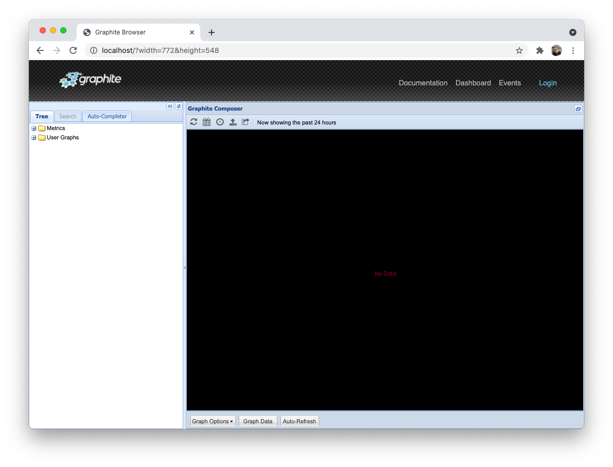

# Reliability Nirvana
## GopherCon 2021

This repo contains the various materials used as part of the ["Reliability Nirvana"](https://www.gophercon.com/agenda/speakers/1221929) 
presentation.

Contents:

* `./svc` - idempotent sample service
* `./example1` - bare-bones sample producer & consumer
* `./docker-compose.yaml` - rabbitmq, etcd and statsd + graphite (for demo visualization)
  * `docker-compose.yaml up -d` - to bring up all
  * or 
  * `docker-compose up -d $specific-dependency`
* `./assets` - config files for graphite, screenshots for this repo

Once docker-compose is finished, you should be able to view the graphite UI by pointing
your browser at `http://localhost:80` and see something like this:

The `orders` and `notify` services will emit the following metrics:

* `$service_new_order_ok`
  * Emitted by service when an event is processed successfully
* `$service_new_order_skipped`
  * Emitted by service when an event is skipped

These metrics can be found under the path: `Metrics/stats_counts/$service_new_order_*`

## Demo

### 1. Basic consume/produce

1. Bring up dependencies
   1. `docker-compose up -d`
2. Verify dependencies are up
3. Bing up services
   1. `cd svc && SERVICE_NAME=order go run *.go`
   2. In another terminal: `cd svc && SERVICE_NAME=notify go run *.go`
4. Publish an event 
   1. `plumber write rabbit --exchange events --input-data '{"type":"new_order","id":"123"}' --routing-key=foo`
5. Observe services consume the event
   1. `orders_new_order_ok` metric will increase in Graphite UI (http://localhost:80)
   2. `notify_new_order_ok` metric will increase

### 2. Recovery - one of the consumers is down (for a while)

1. Bring down `notify` service (via `ctrl-c`)
2. Publish another event
3. Observe service `orders` consume the event
   1. `orders_new_order_ok` metric will increase
   2. `notify_new_order_ok` metric will **not** increase
4. Bring up "notify" service
   1. `cd svc && SERVICE_NAME=notify go run *.go`
5. See it consume the event
   1. `notify_new_order_ok` metric will increase on its own

### 3. Idempotency

1. Publish several events via `plumber`
2. `orders` and `notify` services will both consume and process the messages each time
3. `orders_processed` and `notifications_sent` metrics will increase...
4. **^ But this is incorrect** - it's the same event - we shouldn't be processing duplicate events
5. Enable etcd usage by restarting services and setting an ENV var:
   1. `cd svc && ENABLE_ETCD=true SERVICE_NAME=orders go run *.go`
   2. `cd svc && ENABLE_ETCD=true SERVICE_NAME=notify go run *.go`
6. Publish a single event
7. Watch services consume the event
   1. `orders_new_order_ok` & `notify_new_order_ok` will increase
8. Publish an event once more
9. Both services will _skip_ the event because the message id has been seen
   1. `orders_new_order_skipped` & `notify_new_order_skipped` metrics will be populated
10. Restart the services and re-emit events
11. Services will instantly skip the message (due to initial cache import)
